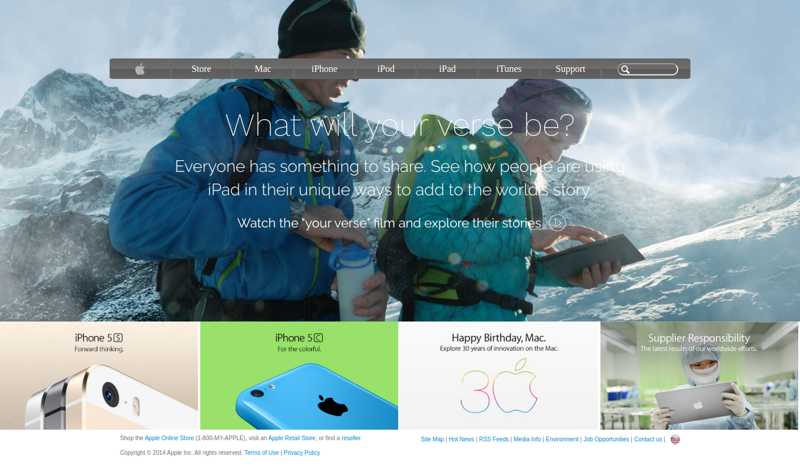

# HTML CSS Project 4

Fourth Microverse Project made by Oscar Andrés Russi Porras

# HTML Gradients

Fourth Microverse HTML and CSS Project

# What it does

It is the Frontend of an Apple page

## Built With

- HTML5
- CSS3
- Visual Studio Code

#### and deployed to GitHub

## Live Demo not available until merge with master branch

[Live Demo]()

## 🤝 Contributing

This is a project for educational purposes only. We are not accepting contributions.

## Attributions and Credit

Special thanks to Microverse, for this learning opportunity. 

## Show your support

Give a ⭐️ if you like this project!

## Enjoy!
